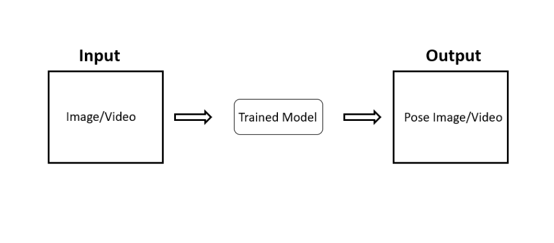
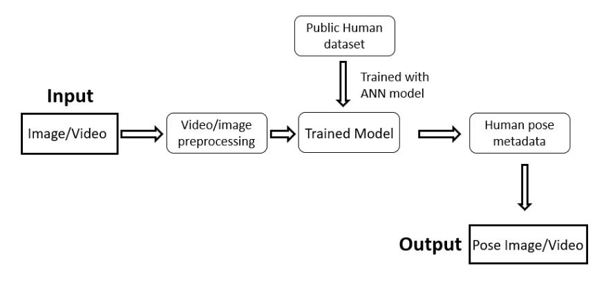
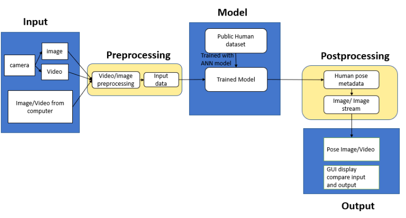

# 3D-Human-Pose
## Team Names and Contact Information
* Yuan Cheng: chengyu@mail.uc.edu
* Advised by Dr.Chia Yung Han: han@ucmail.uc.edu

## Project Abstract
### Goal:
	Implementing a deep learning based human pose estimation application that predicts human pose from videos or camera stream in real-time.
### Project Components:
	* Deep learning model training; 
	* Video processing application framework design. 
### Keywords:
	Python, Deep learning, CNN, Pose estimation, Image processing, GUI.

## User Stories and Design Diagrams
* [User Stories](User_Stories.md)
* Design Diagrams
    * Diagram1High-Level Design of the Input, Model, Output Layer.
    * Diagram2More details diagram illustration including preprocessing and training dataset.
    * Diagram3Further more detailed diagram including details about each parts
## Tasks, Milestone, Timeline, and Effort Matrix
* [Task List](Tasklist.md)
* [MilestoneTimelineAndEffort](MilestoneTimelineAndEffort.md)

## PPT Slideshow (includes ABET Concerns)
[3D Human Pose Application Slides]()

## Self-Assessment Essay
[Self-Assessment Essay](Self-Assessment Essay.md)

## Professional Biography
[Professional Biography](Professional_Biography.md)

## Budge
* Requiring Video Recording equipment i.e. Camera.

## Appendix
* This is an individual project such that all the works have done by Yuan Cheng.
* Reference